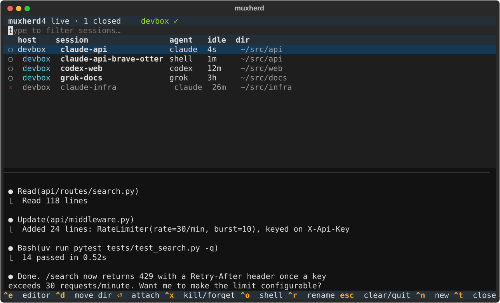

# muxherd

Herd your AI coding agents — Claude Code, Codex, Grok Build — running in named tmux
sessions on one or more machines, and jump between them from anywhere on your tailnet.



- **One picker for every host.** muxherd lists tmux sessions on this machine and on any
  host you can reach over ssh, polling every 2 seconds.
- **Agents start in a login shell.** The agent command is typed into a normal shell, so
  it gets your full environment, and quitting the agent leaves you at a prompt instead
  of losing the session.
- **mosh for remote attach.** A laptop on flaky Wi-Fi stays connected, and the tmux
  session survives either way.
- **Closed sessions are remembered.** Every session is recorded in a small SQLite
  registry on the host that runs it. When a session ends, it stays in the list marked ✕,
  and Enter reopens it with the same name and directory. For Claude Code, that resumes
  the same conversation.
- **Nothing runs in the background.** muxherd talks to `tmux` directly, or over `ssh`
  for remote hosts, reusing one ssh connection per host via ControlMaster.

## Install

```sh
uv tool install muxherd          # or: pipx install muxherd
# latest from GitHub:
uv tool install git+https://github.com/kgx/muxherd
# or from a clone (a standalone copy, not linked to the repo):
make install      # `make update` = git pull + reinstall; plain `make` lists targets
```

This installs `muxherd` and the short alias `mh`.

## Requirements

- **Python 3.11+** and [uv](https://docs.astral.sh/uv/) (or pipx) to install it.
- **tmux 3.x** on every machine that runs sessions.
- **muxherd on every machine that runs sessions,** not just where you use the picker.
  Clients call `muxherd _host ...` on remote hosts over ssh.
- **Non-interactive ssh** from your laptop to each host (key auth or Tailscale SSH).
- **mosh** (optional, recommended) on both ends for roaming-friendly attach.
- **VS Code with Remote - SSH** (optional) for `ctrl+e`.
- Linux and macOS are supported. A private network such as Tailscale is strongly
  recommended (see [Security](#security)).

## Setup

**Host machine** (where the agents run, e.g. `devbox`):

```sh
sudo apt install tmux mosh      # macOS: brew install tmux mosh
mh init                         # config with this machine as "local"
```

**Client laptops:**

```sh
brew install mosh               # or apt install mosh
mh init --no-local -r devbox # only show the remote host's sessions
# or keep local sessions too:   mh init -r devbox
mh doctor                       # check versions, tmux settings and the clipboard path
```

`-r NAME` uses `NAME` as the ssh target (with MagicDNS that's the tailnet hostname).
Use `-r NAME=user@target` or an `~/.ssh/config` alias when they differ.

Remote hosts need **non-interactive ssh** (key auth, or Tailscale SSH) because muxherd
polls them with `ssh -o BatchMode=yes`. Make sure `ssh devbox true` works without
a prompt.

### Keeping it on the tailnet

muxherd only ever talks to the targets in your config, so the tailnet boundary comes
from the host's firewall. On the host:

```sh
sudo ufw default deny incoming
sudo ufw allow in on tailscale0                       # ssh + mosh only via tailnet
sudo ufw enable
```

mosh starts with an ssh login and then uses UDP 60000–61000, which the `tailscale0` rule
covers. To keep sshd off other interfaces entirely, set
`ListenAddress <tailscale-ip>` in `sshd_config`, or turn on Tailscale SSH
(`tailscale up --ssh`) and close port 22.

## Usage

```sh
mh                       # picker; after you detach you're back in it (--once to exit instead)
mh a infra               # attach (or reopen if closed): name, host:name, or unique substring
mh code infra            # open the session's directory in VS Code (no name: picker)
mh sh infra              # throwaway shell (own tmux session) in the session's project dir
mh new -a codex          # new codex session in cwd, named codex-<dir>, then attach
mh new api -a claude -H devbox -d ~/src/api -D   # create detached on a host
mh ls                    # live sessions, then closed ones (✕); --live, --sort name|recent
mh kill devbox:api    # kill (asks first; -y to skip); it stays listed as closed
mh forget api            # remove a closed session from the registry
mh rename api api-v2     # rename (live or closed; host:name works too)
mh chdir api ~/src/api-v2   # change a session's project directory
mh hosts                 # reachability check
mh doctor                # check this machine and every host; suggests fixes (changes nothing)
mh doctor --clipboard    # also test copy → your local clipboard through the real attach
```

### Picker keys

| key            | action                                                     |
| -------------- | ---------------------------------------------------------- |
| type           | filter (space-separated terms match host, name, agent, dir) |
| ↑ ↓ PgUp PgDn  | move                                                       |
| ⏎              | attach, or reopen a closed session                         |
| ctrl+n         | new session (agent, host, directory, name); see below      |
| ctrl+r         | rename the selected session (live or closed)               |
| ctrl+d         | change the session's project directory (with dir browser)  |
| ctrl+x         | kill a live session / forget a closed one (with confirm)   |
| ctrl+t         | show/hide closed sessions                                  |
| ctrl+e         | open the session's directory in your editor                |
| ctrl+o         | throwaway shell (own tmux session) in the project directory |
| ctrl+p         | toggle preview pane                                        |
| ctrl+s         | settings: sort, startup defaults, return to picker after detaching |
| F5             | refresh now (it also refreshes every 2s)                   |
| esc            | clear filter, then quit                                    |

In the new-session dialog, the directory field browses the chosen host, over ssh for
remote hosts. It starts out listing directories you've recently used there. As you type,
it lists matching subdirectories. **↑↓** pick one, **Tab** (or **→** at the end of the
line) steps into it, **Enter** on a picked entry takes it, and Enter again creates the
session. Hidden folders appear once you type a leading `.`.

Each session has a **project directory**: where it was started, unless you change it
with `ctrl+d` / `mh chdir`. The list shows it, a closed session reopens there, and the
editor (`ctrl+e`) and throwaway shells (`ctrl+o`) open there. Changing it doesn't move a
running agent. Claude Code still resumes the same conversation from the new directory.

**Coming back:** after you attach from the picker, detaching (`Ctrl-b d`) or the session
ending brings you back to the picker, with the session you just left selected. Esc quits.
Turn this off in settings (`ctrl+s`), with `return_to_picker = false`, or per run with
`mh --once`. When you run `mh` inside tmux on the same host, picking a session switches
your tmux client to it instead, which suits the popup below.

How attach works:
- **Local session, run outside tmux:** `tmux attach`.
- **Local session, run inside tmux:** `tmux switch-client`, so tmux never nests.
- **Remote session:** `mosh <host> -- tmux attach`, falling back to `ssh -t` when mosh
  isn't installed or the config sets `attach = "ssh"`.

## Checking your setup: `mh doctor`

`mh doctor` checks this machine and every configured host, then prints ✓ / ⚠ / ✗ with a fix
for anything that's off. It never changes anything.

- **This machine:** ssh, mosh 1.4+ (needed for clipboard forwarding), the `[editor]`
  command, and whether your `$TERM` has a terminfo entry.
- **Each host:**
  - how fast ssh connects;
  - whether the muxherd version matches yours;
  - tmux and mosh-server versions;
  - the tmux settings below, read by starting a private tmux server with the host's real
    config;
  - a **clipboard check**: in that private server it copies text the way a mouse drag
    does and records what tmux sends to the terminal. This tests behaviour rather than
    guessing from version numbers, which matters because the right clipboard setting
    depends on the tmux version, its terminal library, and mosh.

`mh doctor --clipboard` goes one step further. It attaches you to a throwaway session on
each host, copies a test string there, and checks whether it arrived on this machine's
clipboard, through tmux, mosh and your terminal. It reads the clipboard itself where it can
(`pbpaste`, `wl-paste`, `xclip`); otherwise it asks you to paste.

### Recommended tmux settings

On each host, in `~/.tmux.conf`. `mh doctor` prints only the lines a host is missing.

```tmux
# Touchpad/mouse: scroll through history, drag to select and copy
set -g mouse on
# Let agents (Claude Code, Codex, editors) know when their pane gains or loses focus
set -g focus-events on
# Agents are chatty; the default is 2000 lines
set -g history-limit 50000
# Send copies to your terminal's clipboard (OSC 52), and let apps in tmux do the same
set -g set-clipboard on
# Name the system clipboard explicitly. tmux leaves it blank, which doesn't reach the
# clipboard through mosh. %p1%.0s must stay: newer ncurses rejects formats that skip the
# first parameter, and tmux then silently sends nothing.
set -as terminal-overrides ',xterm*:Ms=\E]52;c%p1%.0s;%p2%s\7'
```

Optional: **jump between sessions without detaching.** `Ctrl-b j` opens the picker in a
popup over whatever session you're in, and picking one switches straight to it:

```tmux
bind j display-popup -E -w 90% -h 80% mh
```

The popup runs `mh` on the host, so it lists that host's sessions (plus any other hosts in
the host's own muxherd config). `mh` must be on tmux's PATH; use the full path, e.g.
`~/.local/bin/mh`, if the popup can't find it.

Optional: keep the mouse selection highlighted after releasing (it's still copied; `q` or
`Esc` leaves copy mode):

```tmux
bind -T copy-mode    MouseDragEnd1Pane send -X copy-pipe-no-clear
bind -T copy-mode-vi MouseDragEnd1Pane send -X copy-pipe-no-clear
```

Apply with `tmux source-file ~/.tmux.conf`, then detach and reattach: tmux reads terminal
settings when a client attaches. With the mouse on, hold Shift (kitty) or Option
(iTerm/Terminal) while dragging to use your terminal's own selection instead.

Your terminal must accept clipboard writes over OSC 52. kitty, WezTerm, iTerm2 (enable
"Applications in terminal may access clipboard"), Ghostty, Windows Terminal and recent
Alacritty and foot do. mosh must be 1.4+ on both ends.

## Throwaway shells

`ctrl+o` in the picker, or `mh sh [name]`, opens a shell in the session's project
directory (where it was started) as **its own tmux session** on the same host. It gets a
generated name next to its parent, e.g. `claude-infra-brave-otter`, and you're attached
to it right away.

- If you get disconnected, it's still there: reattach from the picker like any session.
- `exit` ends it, and the registry forgets it instead of listing it as closed, so shells
  don't pile up.
- The agent's session is untouched (a window in the agent's own session would switch
  every attached client to it).

## Editor

`ctrl+e` in the picker, or `mh code [name]`, opens the session's project directory in
an editor **on the machine you're using**. For sessions on another host, it uses VS Code's
[Remote - SSH](https://marketplace.visualstudio.com/items?itemName=ms-vscode-remote.remote-ssh)
over the same tailnet ssh connection, with an explicit folder URI. The plainer
`code --remote ssh-remote+host /path` form makes VS Code guess whether the path is a file
and often opens the parent folder:

```sh
code -n --folder-uri vscode-remote://ssh-remote+<hex-encoded host>/home/me/src/infra
```

Each laptop needs the Remote - SSH extension and the `code` command on PATH (macOS: VS Code
command palette → "Shell Command: Install 'code' command in PATH"). The first time, VS Code
installs its server on the host automatically. To use another editor, change `[editor]`
in the config: `{path}` is the directory, `{host}` the ssh target and `{uri}` the VS Code
folder URI. For example, Zed: `remote = "zed ssh://{host}{path}"`.

## Versioning

Versions follow semver and come from git tags (`vX.Y.Z`) via `hatch-vcs`, with no version
string in the source. A build of a tagged commit is that version. Later commits build as
dev versions like `0.2.1.dev3+g1a2b3c4` (3 commits past `v0.2.0`), so `mh --version`
shows exactly what a machine is running.

```sh
make version              # what this checkout builds as
make release VERSION=0.2.0  # tag, push and create a GitHub release (clean tree required)
```

## Config

`~/.config/muxherd/config.toml` (override with `$MUXHERD_CONFIG`):

```toml
attach = "mosh"            # or "ssh"

[hosts]
devbox = "local"        # this machine
# laptop = "me@laptop"    # any ssh target

[editor]                   # {path} = project dir, {host} = ssh target, {uri} = VS Code URI
local = "code -n {path}"
remote = "code -n --folder-uri {uri}"

[ui]                       # also editable in the picker: ctrl+s
sort = "name"              # or "recent"; live sessions are always listed first
show_closed = true         # list closed sessions (ctrl+t toggles for the current run)
preview = true             # show the preview pane (ctrl+p toggles for the current run)
return_to_picker = true    # come back to the picker after detaching (mh --once overrides)

[agents.claude]
start = "claude --session-id {id}"   # typed into the new session's shell
resume = "claude --resume {id}"      # typed when reopening a closed session
resumable = "ls ~/.claude/projects/*/{id}.jsonl >/dev/null 2>&1"  # check run before resuming

[agents.codex]
start = "codex"
resume = "codex resume --last"

[agents.grok]
start = "grok"                       # no resume: reopening starts it fresh

[agents.shell]
start = ""
```

`{id}` becomes a fresh UUID when a session starts. muxherd stores it, and `resume` uses
it to pick up the same conversation. If an agent has no `resume`, or the session has no
stored ID, reopening runs `start` instead. `resumable` is an optional shell check that
runs on the session's host first. If it fails, reopening runs `start` with the same ID.
Claude Code only saves a conversation once you send a message, so this covers a session
where you never typed anything. A plain string (`yolo = "claude --dangerously-skip-permissions"`)
is shorthand for `start` only.

## Session registry

Each host keeps a registry at `~/.local/state/muxherd/registry.db` (SQLite; override
with `$MUXHERD_REGISTRY`). It's updated whenever muxherd lists that host's sessions:
live sessions are recorded, and sessions that disappeared are marked closed.
Sessions started outside muxherd (plain `tmux new -s`) are recorded too.

Clients read a remote host's registry with `ssh <host> muxherd _host sync`, so
**install muxherd on every host that runs sessions**. Without it, muxherd falls back
to plain tmux on that host and only shows live sessions.

A session counts as closed from the last time muxherd saw it alive. If no picker was
open when it ended, the close time is approximate.

The agent column shows the agent muxherd launched the session with, which it stores in
the `@muxherd_agent` tmux option. For sessions muxherd didn't create, it shows the pane's
current command instead.

## Security

muxherd adds no network service of its own. It only runs `tmux`, `ssh` and `mosh` as
you, against the hosts in your config. A few things follow from that:

- **Anyone who can ssh into a host as you can do everything muxherd does there.**
  Protect the hosts the usual way: key-only ssh, and ideally reachable only on a private
  network. The [tailnet setup](#keeping-it-on-the-tailnet) above shows one way.
- **The config file is a list of commands.** Agent `start`/`resume`/`resumable` and the
  `[editor]` templates are executed as written, so treat `~/.config/muxherd/config.toml`
  like a shell script: don't run with a config you didn't write.
- **Remote hosts are trusted.** The picker runs `muxherd _host ...` on each host and
  displays what comes back, including pane previews. Only add hosts you control.
- **Agents run with your permissions** inside tmux on the host. muxherd doesn't sandbox
  them. If you use permission-skipping modes (e.g. `--dangerously-skip-permissions`), the
  agent can do anything your user can on that host.
- **Session registries** (`~/.local/state/muxherd/registry.db`) store session names,
  directories and agent conversation IDs, but not conversation content.

## Development

```sh
git clone https://github.com/kgx/muxherd && cd muxherd
uv tool install -e .     # mh runs from your checkout; edits take effect immediately
make test                # pytest
make lint                # ruff check + format check
```

The tests run against a **private tmux server** (each test sets `TMUX_TMPDIR` to a temp
dir) and a temp registry and config, so they're safe to run on a machine with live
sessions. Do the same when trying changes by hand:

```sh
export TMUX_TMPDIR=$(mktemp -d) MUXHERD_REGISTRY=$(mktemp -d)/registry.db
unset TMUX
mh new -D -a shell scratch && mh ls
```

## License

[MIT](LICENSE)
